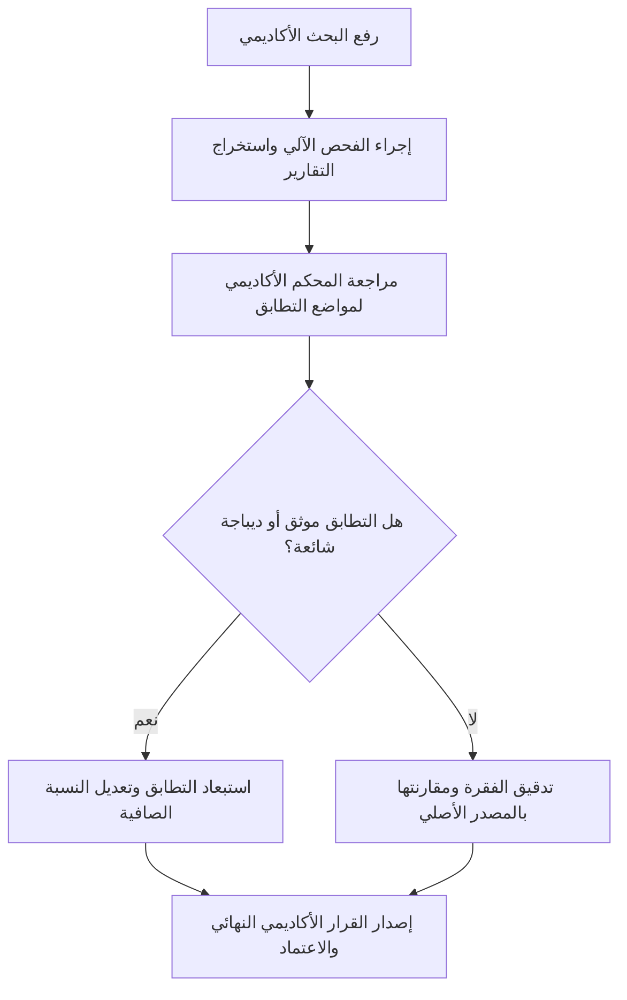

# دليل التشغيل التجريبي الميداني للجامعات واللجان الأكاديمية (Pilot Execution Guide)
## Arabic Academic Plagiarism Detector — Release v1.0.0-rc1

---

### 1. أهداف نطاق المرحلة التجريبية المضبوطة (Pilot Scope & Objectives)

يهدف الإطلاق التجريبي المضبوط (Controlled Pilot) إلى:
1. تقييم أداء المنظومة على نصوص وأطروحات أكاديمية حقيقية غير منشورة في بيئة آمنة ومعزولة.
2. بناء أول حزمة بيانات معيارية محكمة بشرياً (`EXPERT_REVIEWED` >= 100 عينة) عبر أداة `tests/evaluation/reviewer_tool.py`.
3. قياس تفاعل لجان الدراسات العليا والمحكمين مع تقارير الفحص والواجهات الرسومية.

---

### 2. ضوابط الاستخدام المسموح والمحظور (Permitted vs Prohibited Uses)

#### ✅ الاستخدامات المسموحة والموصى بها:
- مساعدة المحكمين ولجان المناقشة في التعرف السريع على مواضع التطابق المحتملة.
- تسريع فرز الأطروحات قبل إرسالها للمناقشة العلنية.
- فحص سلامة التوثيق الأكاديمي وصحة إسناد الاقتباسات للمراجع المعتمدة.

#### ❌ الاستخدامات المحظورة قطيعاً خلال المرحلة التجريبية:
- الرفض التلقائي أو الحرمان من الدرجة العلمية بناءً على نسبة التشابه الرقمية الصادرة عن النظام.
- إطلاق اتهامات سرقة علمية دون مراجعة وتدقيق بشري دقيق من عضو هيئة تدريس مختص.
- الاعتماد المستقل على الكشف في قضايا النزاعات القانونية أو التأديبية دون تقرير تحكيم بشري موقع.

---

### 3. مسار العمل الأكاديمي النموذجي (Standard Reviewer Workflow)

1. **الرفع:** رفع المستند (PDF / DOCX / TXT) واختيار ملف الفحص.
2. **الفحص الفني:** معالجة وتقطيع واستخراج متواليات النصوص والمقارنة مع قاعدة المراجع.
3. **المراجعة والتحكيم:** فحص شاشة التقرير التفاعلية ومقارنة النصوص المشبوهة مع المراجع.
4. **الاعتماد وتجميد التقرير:** عند اكتمال المراجعة، يتم اعتماد التقرير وتوليد بصمة تجزئة SHA-256 لتوفير كشف التلاعب (Tamper Detection).

---

### 4. تصنيف حدود وضوابط التشغيل التجريبي (Operational Limits Classification)

| المعيار التشغيلي | القيمة المحددة | تصنيف القيد (Limit Classification) | التفسير الإجرائي |
| :--- | :---: | :---: | :--- |
| **سعة التخزين لقاعدة البيانات** | $\le 10\text{ GB}$ | **PILOT GOVERNANCE RECOMMENDATION** | توصية حوكمة لضمان كفاءة النسخ الاحتياطي وسرعة المعالجة على عقدة أحادية. |
| **الحد الأقصى للفحوصات المتزامنة** | $2$ | **CONFIGURED LIMIT** | قيد تكويني محدد في `config.py` (`MAX_CONCURRENT_SCANS = 2`). |
| **الحد الأقصى لمعالجة OCR المتزامنة** | $1$ | **MEASURED TECHNICAL & CONFIGURED LIMIT** | قيد فني مقاس ومفروض بقفل ملفات عبر العمليات (`ocr_engine.lock`). |
| **حجم الأبحاث الشهري المستهدف** | $\le 500\text{ أطروحة/شهر}$ | **PILOT GOVERNANCE RECOMMENDATION** | نطاق حوكمة تشغيلي موصى به لضمان قدرة لجان التحكيم على المراجعة البشرية. |
| **عدد الأقسام المشاركة في التجربة** | $\le 5\text{ أقسام علمية}$ | **PILOT GOVERNANCE RECOMMENDATION** | نطاق تجريبي محدود لتسهيل المتابعة وجمع التغذية الراجعة. |

> [!IMPORTANT]
> **قرار الجاهزية النهائي:** المنظومة مصنفة كـ **«READY FOR CONTROLLED PILOT WITH MANDATORY HUMAN REVIEW»**؛ وهي غير معتمدة أو مصرح بها للإطلاق الوزاري المستقل أو اتخاذ قرارات حرمان أكاديمي تلقائية دون إشراف بشري كامل.
