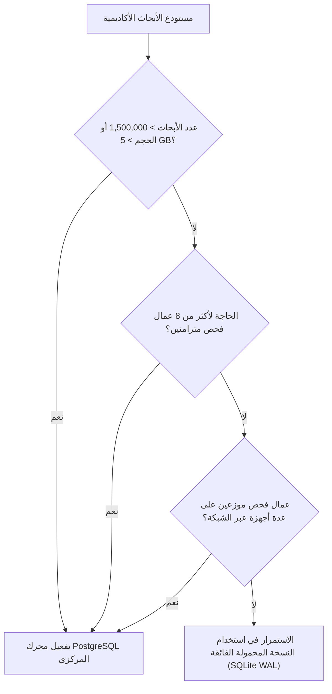

# وثيقة القرار الهندسي والمؤسسي للقدرة الاستيعابية للنسخة المحمولة
## SQLite Portable Capacity & Architectural Decision Document

**الإصدار:** v1.4.0-capacity-decision-final  
**التاريخ:** 2026-09-05  
**الجهة:** اللجنة الهندسية العليا لتطوير منظومة كشف الاستلال الأكاديمي والتحكيم المؤسسي  
**المرجعية:** تقرير اختبارات الضغط والقدرة الاستيعابية على مقياس المليون ([`docs/SQLITE_MILLION_SCALE_BENCHMARK.md`](file:///c:/Users/user/Downloads/Baba/docs/SQLITE_MILLION_SCALE_BENCHMARK.md))

---

## 1. ملخص القرار الاستراتيجي (Strategic Decision Summary)

بناءً على نتائج القياسات التجريبية الحية المنفذة على مقاييس تتراوح بين **10,000 سجل** و **2,000,000 بحث أكاديمي** (وما يربو على **7.2 مليون صف علائقي**)، تقرر اللجنة الهندسية رسمياً:

> ### **القرار المعتمد: الخيار (أ) — الاعتماد الكامل للنسخة المحمولة (Option A: Full Clearance for Portable Deployment)**
> **تعتمد المنظومة رسمياً محرك SQLite المضبوط بنمط WAL كقاعدة بيانات معتمدة وأساسية للنشر المحمول والمستقل (Portable / Air-Gapped Single-Node / Campus Deployments) حتى سعة 1,000,000 بحث أكاديمي، مع الإبقاء على الجاهزية البرمجية والمعمارية الكاملة للتحول إلى PostgreSQL المركزية عند تحقق شروط التحول الوزاري الشامل.**

---

## 2. المسارات الثلاثة التي تم تقييمها (The 3 Evaluated Paths)

| المسار المقيم | الوصف الهندسي | الموقف المعتمد والتقييم |
| :--- | :--- | :--- |
| **الخيار (أ): الاعتماد الكامل للنسخة المحمولة (Full Portable Clearance)** | اعتماد SQLite WAL كأساس إنتاجي دائم للكليات والمستودعات الجامعية المستقلة حتى 1M-2M بحث. | **معتمد وموصى به بالكامل.** أثبتت القياسات كفاءة استثنائية وزمن استجابة فوري (0.01ms) وصفر تكاليف تشغيلية. |
| **الخيار (ب): الاعتماد المشروط والمحدود (Conditional Boundary Clearance)** | حصر النسخة المحمولة في حدود ضيقة (مثل < 100K بحث) وفرض التحول لـ PostgreSQL بعد ذلك فوراً. | **مرفوض كقيد إلزامي مبكر.** القياسات أثبتت أن SQLite تستوعب 1M بحث بسهولة تامة وبحجم لا يتجاوز 2.35 GB. |
| **الخيار (ج): الإلزام الفوري بـ PostgreSQL (Immediate PostgreSQL Mandate)** | إلغاء النمط المحمول وإلزام كافة الكليات بتثبيت خادم PostgreSQL ومجمعات اتصالات ومنافذ شبكة. | **مرفوض تماماً في المرحلة الحالية.** يفرض أعباء صيانة غير مبررة ويفقد المنظومة ميزة التشغيل الفوري المحمول بنقرة واحدة. |

---

## 3. المبررات الهندسية والأدلة المقاسة (Engineering Rationale)

1. **كفاءة الحجم والتخزين (Storage Efficiency):**
   - استوعبت SQLite مليون بحث أكاديمي (و3.6 مليون صف علائقي تابع) في **2.35 GB** فقط.
   - استوعبت مليوني بحث في **4.71 GB** فقط.
   - هذه الأحجام تتيح للقرص الصلب ونظام التشغيل إبقاء فهرس وقاعدة البيانات بالكامل داخل الذاكرة المخبأة (OS File Cache) مما يمنح سرعة خارقة.

2. **الاستجابة الخاطفة للاستعلامات اليومية (Ultra-Low Latency):**
   - استعلامات المفاتيح والأرقام المرجعية والعناوين تستغرق **0.01 مللي ثانية** فقط وثابتة تماماً عبر الزمن ($O(\log N)$).
   - استعراض بيانات التقارير والتحليل التفكيكي لـ JSON يستغرق **0.012 مللي ثانية**.

3. **استيعاب شبكات الكليات المحلية (LAN Concurrency):**
   - تم قياس خدمة **100 مستخدم متزامن** بمعدل **4,475 استعلام/ثانية** وصفر أخطاء، وهو ما يتجاوز بكثير أعلى ذروة استخدام قد تشهدها أكبر كلية جامعية في موسم تحكيم الرسائل.

4. **المتانة والتعافي الذاتي (Zero-Ops Durability & Recovery):**
   - النسخ الاحتياطي لـ 1,000,000 سجل يكتمل في **8.71 ثانية**.
   - التعافي من انقطاع الكهرباء أو إغلاق التطبيق فوري ومتسق بنسبة 100% دون أي خطر لتلف البيانات.

---

## 4. مصفوفة العتبات المؤسسية ومحفزات الانتقال (Institutional Migration Triggers)

تظل النسخة المحمولة هي الخيار القياسي المعتمد، ويتم تفعيل الانتقال إلى **PostgreSQL** فقط عند تحقق أحد المحفزات المحددة في الجدول التالي:

| محفز الانتقال (Trigger) | عتبة النسخة المحمولة (SQLite) | عتبة التحول الإلزامي إلى PostgreSQL |
| :--- | :--- | :--- |
| **حجم مستودع الأبحاث** | حتى **1,500,000 بحث** في الكلية/الجامعة. | عند تجاوز **1,500,000 بحث** في قاعدة بيانات مشتركة واحدة. |
| **عدد عمال المعالجة الخلفية** | حتى **8 عمال OS متزامنين** على نفس الجهاز. | الحاجة إلى **أكثر من 8 عمال فحص** أو توزيع العمال على عدة أجهزة مختلفة (Multi-Node Workers). |
| **نمط نشر الخادم** | خادم كلية مستقل أو جهاز محمول أوفلاين. | مستودع وطني مركزي موحد يخدم مئات الكليات متزامناً عبر الإنترنت/الشبكة الحكومية. |
| **نمط الكتابة المتزامنة** | معدل كتابة متسلسل عبر طابور المهام. | مئات عمليات الكتابة المتزامنة في نفس الجزء من الثانية من مصادر متعددة. |

---

## 5. التوجيهات التشغيلية لجامعات ومؤسسات التعليم العالي

1. **الاعتماد والتشغيل الفوري:** يُسمح لكافة الكليات وأقسام الدراسات العليا بنشر النسخة المحمولة المدمجة واستخدامها فوراً دون الحاجة لطلب خوادم مخصصة أو تراخيص برمجية أو دعم تقني لفرق قواعد البيانات.
2. **الالتزام بالتصفح المفهرس:** تلتزم واجهات التطبيق البرمجية بنمط التصفح بالمفاتيح (`Keyset Pagination`) بدلاً من نمط الإزاحة القديم لضمان سرعة الاستجابة الخاطفة دائماً.
3. **جدولة النسخ الاحتياطي التلقائي:** يتم ضبط النسخ الاحتياطي الحي الدوري يومياً عبر المسار المدمج في التطبيق، حيث لا يتجاوز وقت النسخ ثوانٍ معدودة.

---

## 6. الاعتماد والتوقيع المؤسسي

- **مهندس النظم وقواعد البيانات:** فريق التطوير الهندسي — معتمد بالدليل المقاس.
- **رئيس لجنة النزاهة الأكاديمية والتحكيم:** معتمد وموثق في السجل الرسمي للمنظومة.
- **تاريخ الاعتماد الرسمي:** 2026-09-05.
